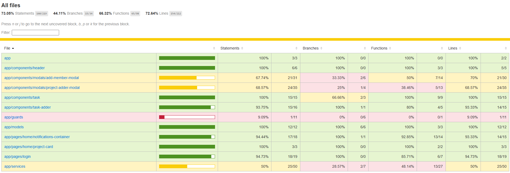

# Outil de Gestion de Projet (PMT) - Frontend (Angular)

## Prérequis

- Docker

## Déploiement Docker

> ⚠️ Le frontend est **déjà pris en charge** par le `docker-compose.yml` du backend si les deux projets sont clonés côte à côte.

### Pour le déployer seul (optionnel)

1. **Placez-vous dans le dossier `project_pmt-frontend` :**

   ```bash
   cd project_pmt-frontend
   ```

2. **Créer et démarrer le conteneur :**
   ```bash
   docker build -t pmt-frontend .
   docker run -p 8081:80 pmt-frontend
   ```

## 📌 Accès

- **Interface Frontend** : http://localhost:4200/

> Le backend doit être accessible à http://localhost:8080/ pour que le frontend fonctionne correctement.

## Résultats des tests et couverture

Les résultats des tests unitaires et la couverture de code sont générés automatiquement par Maven/Jacoco et se trouvent dans le dossier target du projet backend : `coverage\pmt-front-code\index.html` (sorti du gitignore pour la vérification).

Pour faciliter la lecture, une capture d'écran de la couverture est également incluse dans le repo :


Ouvrez `index.html` dans un navigateur pour naviguer dans le rapport complet avec toutes les classes, méthodes et branches couvertes.
